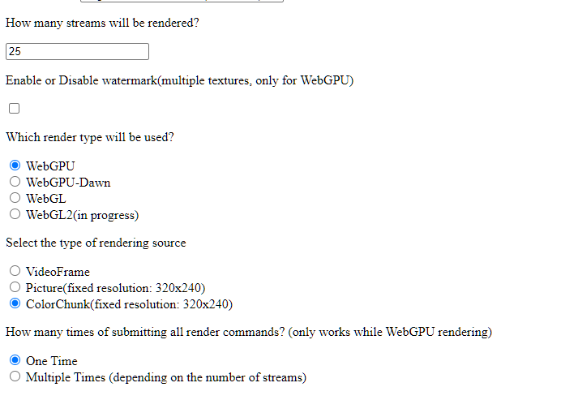
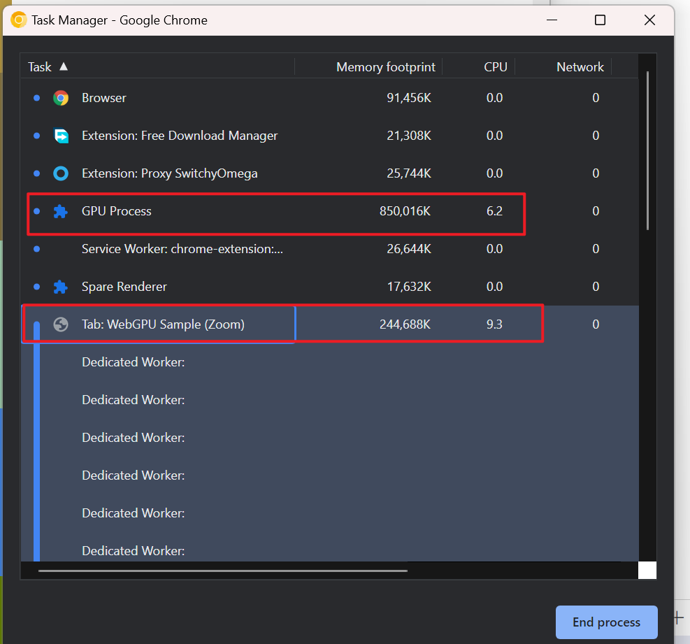

# WebGPU Demo

I am happy to dedicate myself to exploring the possibility of WebGPU. Now we can run the demo code locally to test WebGPU and compare the performance between WebGPU/WebGL/WebGL2(in progress).

The demo code is based on a WebCodec sample and expands its UI by adding WebGPU/WebGL/WebGL2 options on it. So, if you are going to run the demo, here are some options you need to know how to use.

## Prepare
You will see this catalog after downloading the demo code.

    -webgpu
        -render_vf
            -js
                -DataWorker.js
                -main.js
                -RendersWorker.js
                -StreamWorker.js
                -WebGL2Render.js
                -WebGLRender.js
                -WebGPURender.js
                -WorkerMgr.js
            -index.html
            -pic.jpg
            -README.md
            -splash.jpg

### Files
`main.js`: handles options and configurations on the web page

`WorkerMgr.js`: it creates and manages all the workers, binds some workers together

`StreamWorker.js`: captures video frames and dispatch them to the DataWorkers

`DataWorker.js`: each stream(video) represents a DataWorker. it sometimes generates fake frames and dispatches them to the RendersWorker, sometimes, it dispatches the video frames directly to the RendersWorker

`RendersWorker.js`: it creates all kinds of renderers and receives the video frames then sends them to renderers

`WebGPURender.js/WebGLRender.js/WebGL2Render.js`: renderer classes

### Steps
1. make sure Python installed
2. make sure Google Chrome or Google Chrome Canary is installed (if is Google Chrome, version > 113 would be better)
3. if Google Chrome, please enable the WebGPU option in flags (open chrome://flags and find the WebGPU option then enable it, the browser will relaunch)
4. keep a camera connected to your PC or laptop
5. keep port 8000 or 9000 available

## Launch
Once the preparation is ready, we can start the test now.
1. Go to folder `render_vf`
2. Start a Terminal(MacOS) or Cmd Prompt/PowerShell(Windows) under this folder
3. Type `python3 -m http.server` or `python -m http.server` to start the localhost, if you want to change another port, `python3 -m http.server 9000`
4. Open the browser (Google Chrome Canary is recommended)
5. Go to `http://localhost:8000` if the port is 8000 (default port)
6. Now you can see the UI of the demo code
7. Give permission of accessing the camera, if don't, you can't test

## Start

### WebGPU/WebGL

If you want to test WebGPU or WebGL, you need to have the following configs on the page:

- Resolution: default is QVGA(320x240), the max supported resolution here that you can choose is FullHD
- Video Source: a list of connected cameras, to select a camera that you prefer
- Streams: you should give a number of the streams that you want to render, it's better to set 4/9/16/25/36/49... NxN streams
- Render Type: **WebGPU/WebGL**/WebGL2
- Render Source: VideoFrame/Picture/ColorChunk
    - VideoFrame: video frames from web camera capturing and you will see the frames rendered on the canvas
    - Picture: decode a local picture and render it on the canvas
    - ColorChunk: generate a chunk of color and render it on the canvas
- watermark option: If you want to test multiple textures like watermark, please enable it. Only WebGPU supports this option, WebGL/WebGL2 is in progress.

Now, you have the necessary configs and next, click the Start button on the web page.
In the Render Area, you will see the result.

### WebGL2
In Progress. The WebGL2 way is still in progress but you can do some simple tests on the options above.
Update asap.

## End/Reload
Every time you want to set up some different options, please reload the page even though you can click the stop button. The Stop button can't go back to the main UI again, so reloading will work.

## Notice
The result of WebGPU/WebGL/WebGL2 is a little different between Mac and Windows. We are going to publish a report of performance according to the result. 

## How to test?
In a Zoom meeting, two scenes are usually used, gallery video mode and speaker video mode. Normally, the speaker mode displays a list of small videos which have lower resolution and a large video with hight resolution, like 720p. The gallery mode display 25 videos at most one time with the same size of video area.

However, in this sample, **you can only simulate the gallery video mode** like a Zoom meeting because it only supports drawing multiple videos with the same size. As for the speaker video mode, it will be supported as soon as possible.

Next, here we illustrate how to simulate the gallery video mode.

### Test Steps
1. open the site https://webgpu-eight.vercel.app/
2. allow the camera permission
3. ignore the options like bitrate, keyframe interval, HW preference, Latency goal, etc
4. fill in the streams that you want, like 25 streams
5. select the render type, if focus on WebGPU, just select WebGPU, if want to compare the performance between WebGPU and WebGL, you can select WebGL to have another test
6. select the source of rendering, it shoule be VideoFrame or ColorChunk
7. select one-time or multiple-times
    - if you select one-time, that means all rendering commands will be recorded together and sent all of them to GPU in one time
    - if you select multiple-times, that means each video has its own rendering command cycle, rendering will be executed one by one
8. click start button

#### case 1: how to compare WebGL and WebGPU?
1. streams: 25
2. render type: WebGL(first) / WebGPU(second)
3. source: ColorChunk (because a color chunk represents a YUV buffer, not a video frame)
4. times of submit: One Time
5. click start

We just care about the two aspects: **GPU process CPU usage** and **CPU usage**.

#### case 2: how to compare the performance of times of submitting rendering commands?
1. streams: 25
2. render type: WebGPU
3. source: ColorChunk (because a color chunk represents a YUV buffer, not a video frame)
4. times of submit: One Time(first) / Multiple Times(second)
5. click start
